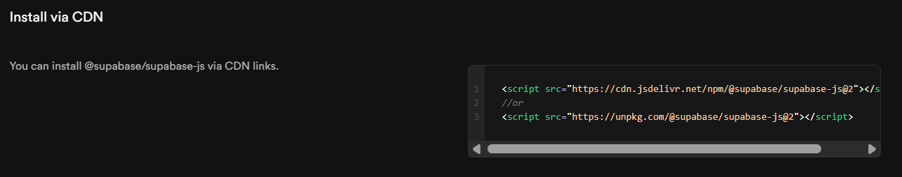
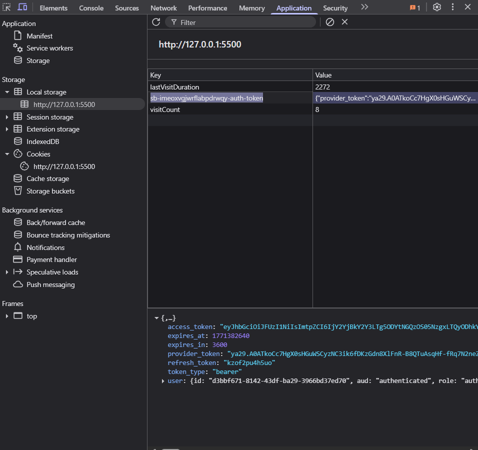
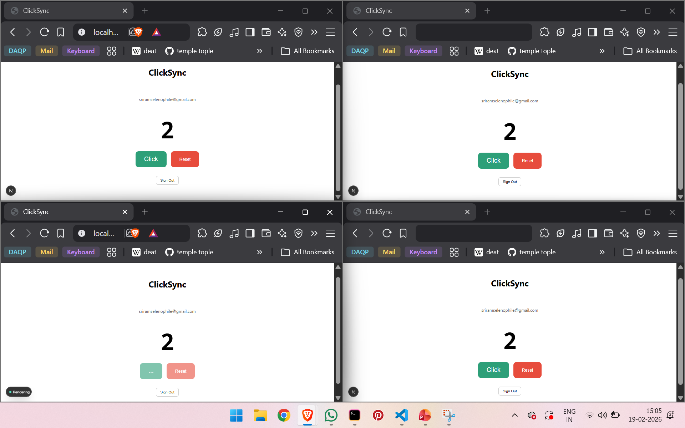

# Bookmark.

A private, real-time bookmark manager built with Next.js, Supabase, and Tailwind CSS.

🔗 **Live URL:** https://smart-bookmark-nine-nu.vercel.app/

## Mobile optimised (iOS, Android) with dark and light themes

<p align="center">
  
  &nbsp;&nbsp;&nbsp;&nbsp;
  
</p>

## Tech Stack

- **Next.js 14** (App Router) - React framework with server components
- **Supabase** - Auth (Google OAuth), PostgreSQL database, Realtime WebSocket
- **Tailwind CSS** - Utility-first styling
- **next-themes** - Dark/light mode

## Features

- Google OAuth sign-in (no passwords)
- Add bookmarks with URL, title, and tags
- Auto-fetches page title when you enter a URL
- Delete bookmarks with confirmation
- Real-time sync across tabs and devices via Supabase Realtime (WebSocket)
- Filter by tag, search by title/URL/tag, sort by date or alphabetically
- Dark and light mode with system preference detection
- Fully mobile responsive

## Local Setup

1. Clone the repo:
```bash
   git clone https://github.com/YOUR_USERNAME/smart-bookmark.git
   cd smart-bookmark
   npm install
```

2. Create `.env.local`:
```
   NEXT_PUBLIC_SUPABASE_URL=your_supabase_url
   NEXT_PUBLIC_SUPABASE_ANON_KEY=your_supabase_anon_key
```

3. Run:
```bash
   npm run dev
```

## Database Schema
```sql
create table public.bookmarks (
  id uuid default gen_random_uuid() primary key,
  user_id uuid references auth.users(id) on delete cascade not null,
  url text not null,
  title text not null,
  tags text[] default '{}' not null,
  created_at timestamptz default now() not null
);
```

Row Level Security is enabled - users can only access their own bookmarks.

# Learning (what broke, how it was fixed)

**Stack:** Next.js 15 App Router · TypeScript · Tailwind CSS · Supabase (Auth + DB + Realtime) · Vercel

I've previously worked with Next.js and OAuth so there were no doubts there.

But with Supabase Realtime Websockets (for updates across tabs / devices) I had some doubts.

Previously, I have experience using tanstack query to invalidate cache which will re-fetch the latest updates and the update is done across pages wherever previous stale resource has been found (by query key).

But this time, the need is quite similar but different in it that:
Change in DB => PUSH to all user instances 

```ts
  await supabase.channel(`bookmarks:${user.id}`).send({
    type: "broadcast",
    event: "INSERT",
    payload: data,
  });
```

Similarly, for delete

```ts
  await supabase.channel(`bookmarks:${user.id}`).send({
    type: "broadcast",
    event: "DELETE",
    payload: { id },
  });
```

The authorization part here is enforced via RLS policies.


Besides that, I spent time on understanding the supabse utilities and documentation for proxy, createServerClient and createBrowserClient, their implications and why they are configured the way they are.

### Tinkering around with supabase libraries

I experimented with supabase utilities and created a simple HTML, JS file using supabase js cdn to check out how supabase client utilities actually work.
You can find the link to that repository [here](https://github.com/ram-sharanga/smart-bookmark-concepts/tree/main/Concept-1%20Supabase%20Browser%20Client)

# Concepts I learned:

**Pet project - Cookie Inspector:**
Build a plain HTML page (no framework) that:
1. Creates a Supabase client
2. Signs in with Google
3. After login, reads `document.cookie` and shows all Supabase session cookies on screen
4. Calls `supabase.auth.getUser()` and displays the user object
5. Has a "Refresh session" button that calls `supabase.auth.refreshSession()` and shows the new token

https://supabase.com/docs/reference/javascript/introduction



https://supabase.com/docs/guides/auth/server-side/creating-a-client?queryGroups=framework&framework=express#create-a-client


## 1. The SUPABASE_URL

A unique URL (e.g., https://xyz.supabase.co) that points to our specific instance of PostgreSQL, PostgREST, and GoTrue.

### Purpose:
Every time we make a call:

```js
supabase.from('users').select()
```

the library uses this URL to know which server in the world to send that request to.

---

## 2. The SUPABASE Anon / SUPABASE Publishable Key

Key used by Supabase to extract information about the user being a 'guest' or 'anonymous' user. Used along with the Supabase API

#### Example:
*RLS (Row Level Security)*

If our database has a rule saying SELECT is only allowed for authenticated users, the API looks at this Anon Key, sees user is not logged in yet, and rejects the request.

---

## 3. Why Are We Creating a Client?

Without Client, we would have to write raw `fetch()` requests for every single thing.

For example, to get data, we have to do this manually:

```js
const response = await fetch('https://your-url.supabase.co/rest/v1/users', {
  headers: {
    'apikey': 'YOUR_ANON_KEY',
    'Authorization': 'Bearer YOUR_ANON_KEY'
  }
});
```

---

## The Purpose of Creating the Client

- Configure Defaults:
  It remembers our URL and Key so we don't have to type them every time.

- Manage State:
  It tracks if a user is logged in.
  It holds the Session in memory.

- Provide a Query Builder:
  It turns:
  ```js
  supabase.from('table').select('*')
  ```
  into the complex URL syntax that the PostgREST server understands.

- Handle WebSockets:
  It manages the persistent connection for Realtime features (like a chat app) so you don't have to manage raw socket heartbeats.

---

# Explanation of Supabase Script Implementation

## 1. Setting Up Project Credentials

```js
const SUPABASE_URL = "https://imeoxvgjwrflabpdrwqy.supabase.co";
const SUPABASE_PUBLISHABLE_KEY =
  "sb_publishable_4eQ3FJ6tujrmEors6odkcA_O7DmiDoe";
```

- `SUPABASE_URL` → This is the address of my Supabase backend.
- `SUPABASE-PUBLISHABLE-KEY` → This is the public (safe) key that allows my frontend to communicate with Supabase under controlled permissions.

---

## 2. Creating Supabase Client

```js
const supabaseClient = supabase.createClient(
  SUPABASE_URL,
  SUPABASE_PUBLISHABLE_KEY,
);
```

A Supabase client instance is created.

What this does for me (as explained above):

- It remembers my project URL.
- It remembers my publishable key.
- It allows me to call authentication and database methods easily.
- It manages session state internally.

---

## 3. Updating UI

```js
async function updateUI() {
  document.getElementById("cookie-display").innerText =
    document.cookie || "Empty";

  const {
    data: { user },
    error,
  } = await supabase.auth.getUser();

  document.getElementById("user-display").innerText = JSON.stringify(
    user || error || "No User",
    null,
    2,
  );
}
```

In this function:

1. I display the current browser cookies.
2. I call `supabase.auth.getUser()` to check if a user is logged in.
3. I display either:
- The logged-in user object  
- An error  
- Or "No User" if nothing exists  

This keeps the UI in sync with the authentication state.

---

## 4. Signing In with Google

```js
async function signInWithGoogle() {
  await supabase.auth.signInWithOAuth({
    provider: "google",
    options: { redirectTo: window.location.href },
  });
}
```

Here, we:

- Trigger an OAuth login flow using Google.
- Redirect the user back to the same page after authentication.

Supabase handles:
- Redirecting to Google
- Receiving the OAuth callback
- Creating a session

After successfully signing in with gooogle:



---

## 5. Refreshing Session

```js
async function refreshMySession() {
  await supabase.auth.refreshSession();
  updateUI();
}
```

This function:

- Forces Supabase to refresh the current authentication session.
- Then updates my UI to reflect the new session state.

---

## 6. Logging Out

```js
async function logout() {
  await supabase.auth.signOut();
  updateUI();
}
```

This:

- Logs the user out.
- Clears the session.
- Updates the UI to reflect that no user is logged in.

---

## 7. Initial UI Load

```js
updateUI();
```

When the page loads, I immediately call `updateUI()` so that:

- I can see any existing cookies.
- I can check if a session already exists.
- My UI reflects the correct authentication state.

---

## Overall Flow (How I Designed It)

1. I initialize Supabase with my project credentials.
2. I create a client to communicate with Supabase.
3. I provide:
- Google login
- Session refresh
- Logout
4. I keep my UI synced with the authentication state at all times.

This script is essentially a small authentication test harness for tinkering with supabase client, observing cookies, session state, and user data in real time.

## Learning by Doing

I applied all the concepts in another project of mine [ClickSync](https://github.com/ram-sharanga/clicksync)


Here I applied once again the google OAuth, RLS on supabase table, Policies, Broadcast - realtime etc.


