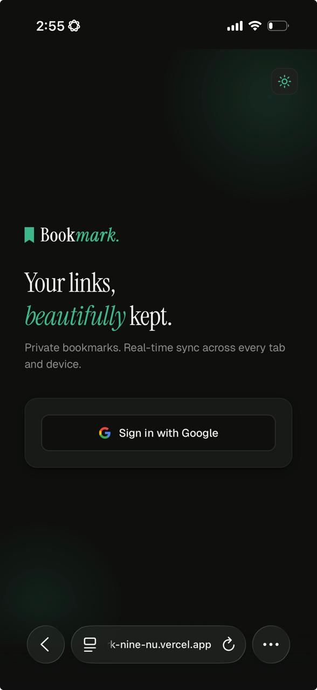
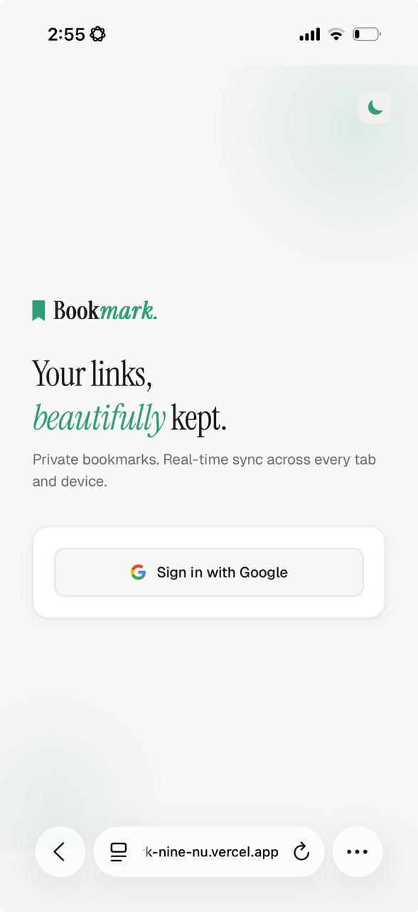

# Bookmark.

A private, real-time bookmark manager built with Next.js, Supabase, and Tailwind CSS.

🔗 **Live URL:** https://smart-bookmark-nine-nu.vercel.app/

## Mobile optimised (iOS, Android) with dark and light themes





## Tech Stack

- **Next.js 14** (App Router) - React framework with server components
- **Supabase** - Auth (Google OAuth), PostgreSQL database, Realtime WebSocket
- **Tailwind CSS** - Utility-first styling
- **next-themes** - Dark/light mode

## Features

- Google OAuth sign-in (no passwords)
- Add bookmarks with URL, title, and tags
- Auto-fetches page title when you enter a URL
- Delete bookmarks with confirmation
- Real-time sync across tabs and devices via Supabase Realtime (WebSocket)
- Filter by tag, search by title/URL/tag, sort by date or alphabetically
- Dark and light mode with system preference detection
- Fully mobile responsive

## Local Setup

1. Clone the repo:
```bash
   git clone https://github.com/YOUR_USERNAME/smart-bookmark.git
   cd smart-bookmark
   npm install
```

2. Create `.env.local`:
```
   NEXT_PUBLIC_SUPABASE_URL=your_supabase_url
   NEXT_PUBLIC_SUPABASE_ANON_KEY=your_supabase_anon_key
```

3. Run:
```bash
   npm run dev
```

## Database Schema
```sql
create table public.bookmarks (
  id uuid default gen_random_uuid() primary key,
  user_id uuid references auth.users(id) on delete cascade not null,
  url text not null,
  title text not null,
  tags text[] default '{}' not null,
  created_at timestamptz default now() not null
);
```

Row Level Security is enabled - users can only access their own bookmarks.

# Learning (what broke, how it was fixed)

**Stack:** Next.js 15 App Router · TypeScript · Tailwind CSS · Supabase (Auth + DB + Realtime) · Vercel

I've previously worked with Next.js and OAuth so there were no doubts there.

But with Supabase Realtime Websockets (for updates across tabs / devices) I had some doubts.

Previously, I have experience using tanstack query to invalidate cache which will re-fetch the latest updates and the update is done across pages wherever previous stale resource has been found (by query key).

But this time, the need is quite similar but different in it that:
Change in DB => PUSH to all user instances 

```ts
  await supabase.channel(`bookmarks:${user.id}`).send({
    type: "broadcast",
    event: "INSERT",
    payload: data,
  });
```

Similarly, for delete

```ts
  await supabase.channel(`bookmarks:${user.id}`).send({
    type: "broadcast",
    event: "DELETE",
    payload: { id },
  });
```

The authorization part here is enforced via RLS policies.


Besides that, I spent time on understanding the supabse utilities and documentation for proxy, createServerClient and createBrowserClient, their implications and why they are configured the way they are.

### Tinkering around with supabase libraries

I experimented with supabase utilities and created a simple HTML, JS file using supabase js cdn to check out how supabase client utilities actually work.
You can find the link to that repository [here](https://github.com/ram-sharanga/smart-bookmark-concepts)

## Learning by Doing

I applied all the concepts in another project of mine ClickSync 

Here I applied once again the google OAuth, RLS on supabase table, Policies, Broadcast - realtime etc.


